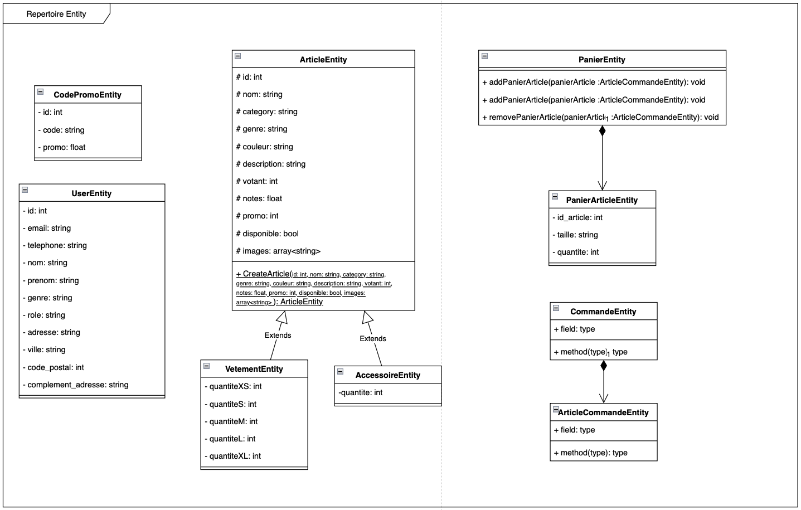

# Qualité de développement
## Introduction
Dans le cadre de la SAE du 3ème semestre, nous avons dévellopé un site de e-commerce. Ce site est codé en PHP et utilise une base de données MySQL (MariaDB). Ce document a pour but de présenter les choix que nous avons fait terme de Design Pattern.

## Patrons de conception choisis
### 1. MVC
#### A quel problème répond le design pattern choisi (pourquoi ?)
Le design pattern MVC permet tout d'abord de mieux séparer les responsabilités de chaque composants. Le modèle représente la logique métier, c'est-à-dire la partie backend (accès au serveur, algorithmes …). La vue s’occupe de l’affichage de l'interface utilisateur et le contrôleur vient s'occuper de la l’interaction utilisateur. 
Le MVC permet également la création de composants et donc d’éviter la duplication de code ainsi que de permettre l’évolutivité de ceux-ci. 

#### Sa mise en œuvre au niveau de la conception détaillée UML (quoi ?)
.
Ci-dessus un apperçu du fonctionnement du MVC. Le routeur permet de rediriger les requêtes vers le bon contrôleur. Le contrôleur va ensuite appeler les modèles nécessaires et les vues nécessaires à l'affichage de la page.


#### Son développement en PHP (comment ?)
Pour le développement en PHP, nous avons séparé le code en 3 dossiers :
-	Backend : contient le code PHP qui s’occupe de la logique métier
-	Frontend : contient le code PHP qui s’occupe de l’affichage de l’interface utilisateur
-   Controller : contient le code PHP qui s’occupe de la gestion des routes

Nous avons du créér un routeur qui permet de rediriger les requêtes vers le bon contrôleur. 
```php
namespace system;

/**
 * Class Router
 */
class Router
{
    /**
     * permet d'éxécuter la méthode d'un controleur choisi
     * si la méthode est omise alors index est choisi
     * Les URL saisies sont de la forme
     *      site/controleur
     *      site/controleur/method
     *      site/controleur/method/param1/...
     */
    function route()
    {
        $scriptName = $_SERVER["SCRIPT_NAME"];
        $requestURI = $_SERVER["REQUEST_URI"];

        //Le script name contient index.php on le supprime
        $prefix = substr($scriptName, 0, strlen($scriptName) - 9);
        //Le suffixe est le requestURI privé du préfix
        $suffix = substr($requestURI,strlen($prefix));
        $params = explode("/", $suffix);
        if (count($params) == 0) {
            echo "no controller found";
            die();
        }

        if ($params[0] == ""){
            $controller = "accueil";
        }else{
            $controller = $params[0];
        }

        array_shift($params);

        if (count($params)==0)
            $controllerMethod="index";
        else
            $controllerMethod=$params[0];
        
        array_shift($params);
            $class = "\controller\\".$controller;
            
            $controllerinstance = new $class();
            if (method_exists($controllerinstance,$controllerMethod)){
                $controllerinstance->$controllerMethod($params);
            }else{
                require "frontend/404.php";die();
            }
    }
}
```
Ensuite, les controlleurs vont `require` les vues et les modèles nécessaires à l'affichage de la page.
```php
namespace controller;

class login{
    function index(){
        require "frontend/authentication/login.php";
    }
}
```


### 2. DAO
#### A quel problème répond le design pattern choisi (pourquoi ?)
Le pattern DAO permet d'encapsuler l’accès aux données et de fournir une interface standardisée pour interagir avec cette source de données (ici, MariaDB).Cette technique permet l’abstraction des détails de la base de données. Cela signifie que les autres parties de l’application n’ont pas besoin de connaître la façon dont les données sont stockées et récupérées. De même, cette méthode permet la réutilisation du code plus facilement ainsi qu’une facilité de maintenance. 

#### Sa mise en œuvre au niveau de la conception détaillée UML (quoi ?)
Sa mise en œuvre consiste à séparer les entités (représentant une ligne dans une table de la base) et de l’autre côté le DAO, représentant toutes les procédures stockées de cette base de données. Sa mise en oeuvre correspond à la suivante : 

.
Ci-dessus un aperçu du répertoire Entity.

.

#### Son développement en PHP (comment ?)
Pour la création des DAO, nous devons créer une classe qui correspond à une table de la base et qui implémente une Interface.
```php
<?php

namespace backend\DAO;

use backend\entity\CodePromoEntity;

interface CodePromoDAOInterface
{
    /**
     * Ajoute un code promo
     * 
     * @param string $code
     * @param int $promo
     * @return CodePromoEntity
     */
    public function add(string $code, int $promo): CodePromoEntity;

    /**
     * Met à jour un code promo
     * 
     * @param CodePromoEntity $entity
     * @return void
     */
    public function update(CodePromoEntity $entity);

    /**
     * Supprime un code promo
     * 
     * @param CodePromoEntity $entity
     * @return void
     */
    public function delete(CodePromoEntity $entity);

    /**
     * Récupère tous les codes promos
     * 
     * @return CodePromoEntity[]
     */
    public function getAll(): array;

    /**
     * Récupère un code promo par son identifiant
     * 
     * @param int $id
     * @return CodePromoEntity|null
     */
    public function getById(int $id): ?CodePromoEntity;
}

```
Nous continuerons d’utiliser User pour l’exemple. 
```php
class DBUser extends Connexion implements CodePromoDAOInterface
{
    public static function add($email, $telephone, $password, $nom, $prenom, $genre, $address, $ville, $code_postal, $complement_adresse)
    {
        $requete = "CALL InsertUserClient(?,?,?,?,?,?,?,?,?,?)";


        $stmt = self::$pdo->prepare($requete);

        $stmt->bindParam(1, $email, \PDO::PARAM_STR); // Mail
        $stmt->bindParam(2, $telephone, \PDO::PARAM_STR); // Téléphone
        $stmt->bindParam(3, $password, \PDO::PARAM_STR); // Mot de passe
        $stmt->bindParam(4, $nom, \PDO::PARAM_STR); // Nom
        $stmt->bindParam(5, $prenom, \PDO::PARAM_STR); // Prénom
        $stmt->bindParam(6, $genre, \PDO::PARAM_STR); // Genre
        $stmt->bindParam(7, $address, \PDO::PARAM_STR); // Adresse
        $stmt->bindParam(8, $ville, \PDO::PARAM_STR); // Ville
        $stmt->bindParam(9, $code_postal, \PDO::PARAM_INT); // Code postal
        $stmt->bindParam(10, $complement_adresse, \PDO::PARAM_STR); // Complément d'adresse

        $stmt->execute();
    }
    public static function update($entity)
    {
        $email = $entity->getEmail();
        $telephone = $entity->getTelephone();
        $nom = $entity->getNom();
        $prenom = $entity->getPrenom();
        $genre = $entity->getGenre();
        $adresse = $entity->getAdresse();
        $ville = $entity->getVille();
        $codePostal = $entity->getCodePostal();
        $complementAdresse = $entity->getComplementAdresse();
        $id = $entity->getId();
        $requete = "CALL UpdateUser(?,?,?,?,?,?,?,?,?,?)";
        $stmt = self::$pdo->prepare($requete);
        $stmt->bindParam(1, $email, \PDO::PARAM_STR);
        $stmt->bindParam(2, $telephone, \PDO::PARAM_STR);
        $stmt->bindParam(3, $nom, \PDO::PARAM_STR);
        $stmt->bindParam(4, $prenom, \PDO::PARAM_STR);
        $stmt->bindParam(5, $genre, \PDO::PARAM_STR);
        $stmt->bindParam(6, $adresse, \PDO::PARAM_STR);
        $stmt->bindParam(7, $ville, \PDO::PARAM_STR);
        $stmt->bindParam(8, $codePostal, \PDO::PARAM_INT);
        $stmt->bindParam(9, $complementAdresse, \PDO::PARAM_STR);
        $stmt->bindParam(10, $id, \PDO::PARAM_INT);


        $stmt->execute();
    }
    public static function delete($entity)
    {
        $requete = "CALL DeleteUser(?)";


        $stmt = self::$pdo->prepare($requete);
        $stmt->bindParam(1, $entity->getId(), \PDO::PARAM_INT);


        $stmt->execute();
        var_dump($entity);
    }
}
```
Du côté de entity nous devons créer une entitée CodePromo : 
``` php
<?php

namespace backend\entity;

/*
* @Entity @Table(name="code_promo")
*/
class CodePromoEntity
{
    /*
    Table SQL CodePromo

    id INT NOT NULL AUTO_INCREMENT PRIMARY KEY, 
    texte VARCHAR(255) NOT NULL UNIQUE,
    promo TINYINT NOT NULL
    */


    private int $id;
    private string $code;
    private int $promo;
    
    public function __construct(int $id,string $code,int $promo) {
        $this->id = $id;
        $this->setCode($code);
        $this->setPromo($promo);
    }

    /* Getters & Setters */

    /*
    * @return int
    */
    public function getId(): int {
        return $this->id;
    }

    /*
    * @return string
    */
    function getCode(): string{
        return $this->code;
    }

    /*
    * @return int
    */
    function getPromo(): int{
        return $this->promo;
    }

    /*
    * @param string $code
    */
    function setCode(string $code){
        return $this->code = $code;
    }

    /*
    * @param int $promo
    */
    function setPromo(int $promo){
        return $this->promo = $promo;
    }
}

?>
```
### 3. Singleton
#### A quel problème répond le design pattern choisi (pourquoi ?)
Le pattern Singleton permet de s'assurer qu'une classe n'a qu'une seule instance et fournit un point d'accès global à cette instance. Dans le contexte de notre site web en php, La classe SPDO représente une connexion à la base de données, et le Singleton garantit qu'il n'y a qu'une seule instance de cette connexion pour un utilisateur.

#### Sa mise en œuvre au niveau de la conception détaillée UML (quoi ?)
.

#### Son développement en PHP (comment ?)
Pour implémenter le singleton, nous avons mis une classe SPDO(system\SPDO.php) dans système. Puis il est utilisé 
```php
namespace system;
/**
* Class SPDO
* @package System
* Connexion à la base de données
*/
class SPDO
{
   private \PDO $connexion;
   private static ?SPDO $PDOInstance=null;


   private function __construct(string $dsn,
                                 ?string $username = null,
                                 ?string $password = null,
                                 ?array $options = null,
                                 ?string $exec = null)
   {
       $this->connexion = new \PDO($dsn,$username , $password, $options);
       // $this->connexion->exec($exec);
   }


   public static function getInstance(string $dsn,
                                       ?string $username = null,
                                      ?string $password = null,
                                      ?array $options = null,
                                      ?string $exec = null):SPDO
   {
       if(!self::$PDOInstance)
       {
           self::$PDOInstance = new SPDO($dsn,$username , $password, $options, $exec);
       }
       return self::$PDOInstance;
   }


   public function getConnexion():\PDO{
       return $this->connexion;
   }
}
```

Et connexion(backend\DAO\connexion.php) utilise le singleton pour récupérer une connexion du driver mariadb

```php
namespace backend\DAO;


use Exception;


require_once 'backend/config/config.php';
/**
* Class Connexion
* @package backend\DAO
* Connexion à la base de données
*/
class Connexion
{
   # attribut de connexion
   static protected \PDO $pdo;


   public function __construct()
   {
      
       try{           
           $pdoinstance = \system\SPDO::getInstance(
               DB_CONFIG["type"].':host='.DB_CONFIG["host"].';port='.DB_CONFIG["port"].';dbname='.DB_CONFIG["dbname"],
               DB_CONFIG["username"],
               DB_CONFIG["password"],
               [
                   // \PDO::MYSQL_ATTR_INIT_COMMAND => "SET NAMES utf8",
                   \PDO::ATTR_TIMEOUT => 3600,
               ]
               );
           self::$pdo = $pdoinstance->getConnexion();
          
       } catch (\PDOException $e) {
           // DEBUG
           // echo $e;
           require 'frontend/500.php';
           die();
       }


   }
}
```

### 4. Factory
#### A quel problème répond le design pattern choisi (pourquoi ?)
Le pattern Factory pour créer des instances à partir de conditions via la superclasse , dans notre code php la superclasse est ArticleEntity. La méthode statique CreateArticle agit comme une factory pour créer des instances de AccessoireEntity ou VetementEntity, qui sont des sous-classes de ArticleEntity. Cela permet de séparer les vêtements et les accessoires car ils n'ont pas la même structure et permet aussi de ne pas avoir à faire de requêtes SQL pour savoir si un article est un vêtement ou un accessoire. 

#### Sa mise en œuvre au niveau de la conception détaillée UML (quoi ?)
.

#### Son développement en PHP (comment ?)
L'implémentation dans le code est dans le dossier Backend\entity
``` php
namespace backend\entity;


class ArticleEntity
{
   protected int $id;
   protected string $nom;
   protected string $category;
   protected string $genre;
   protected string $couleur;
   protected string $description;
   protected int $votant;
   protected float $notes;
   protected float $prix;
   protected int $promo;
   protected bool $disponible;
   protected array $images;


   static function CreateArticle(  int $id,
                                   string $nom,
                                   string $category,
                                   string $genre,
                                   string $couleur,
                                   string $description,
                                   int $votant,
                                   float $notes,
                                   float $prix,
                                   int $promo,
                                   bool $disponible,
                                   string $quantite,
                                   array $images
                                   ) : ArticleEntity
   {
       $newArticle = null;
       if (strtolower($category)=="accessoire"){
           $newArticle = new AccessoireEntity($id, $nom, $category, $genre ,$couleur ,$description ,$votant ,$notes,$prix,$promo,$disponible,intval($quantite),$images);
       }else{
           $lsQuantite = explode(";", $quantite);
           $arrayQuantite = array();
           // Affichage des éléments du tableau résultant
           foreach ($lsQuantite as $element) {
               if ($element != ""){
                   $arrayQuantite[] = intval($element);
               }
           }
           $newArticle = new VetementEntity($id, $nom, $category, $genre ,$couleur ,$description ,$votant ,$notes,$prix,$promo,$disponible,$arrayQuantite,$images);
       }


       return $newArticle;
   }

```

La classe fille VetementEntity:
``` php
namespace backend\entity;


class VetementEntity extends ArticleEntity
{
   private int $quantiteXS;
   private int $quantiteS;
   private int $quantiteM;
   private int $quantiteL;
   private int $quantiteXL;


   function __construct(  int $id,
                                   string $nom,
                                   string $category,
                                   string $genre,
                                   string $couleur,
                                   string $description,
                                   int $votant,
                                   float $notes,
                                   float $prix,
                                   int $promo,
                                   bool $disponible,
                                   array $quantite,
                                   array $images)
   {
       if (count($quantite) != 5){
           throw new \Exception('erreur VetementEntity.php : quantite doit etre un tableau de 5 entiers');
       }
      
       $this->id = $id;
       $this->setNom($nom);
       $this->setCategory($category);
       $this->setGenre($genre);
       $this->setCouleur($couleur);
       $this->setDescription($description);
       $this->setVotant($votant);
       $this->setNotes($notes);
       $this->setPrix($prix);
       $this->setPromo($promo);
       $this->setDisponible($disponible);
       $this->setImages($images);
      
       $this->setQuantiteXS($quantite[0]);
       $this->setQuantiteS($quantite[1]);
       $this->setQuantiteM($quantite[2]);
       $this->setQuantiteXL($quantite[3]);
       $this->setQuantiteL($quantite[4]);
   }
}
```

La classe fille AccesoireEntity n’a que quantité dans les attributs

### 5. Façade
#### A quel problème répond le design pattern choisi (pourquoi ?)
Le design pattern façade permet de fournir une interface unifiée à un ensemble d'interfaces d'un sous-système tout en préservant la flexibilité nécessaire. En clair, il ajoute des méthodes privées à une classe qui permettent de simplifier l'utilisation de cette classe. Dans notre cas, nous avons utilisé ce design pattern pour simplifier l'utilisation de la classe PDO.


#### Son développement en PHP (comment ?)
Par exemple, nous l'avons utilisé dans le DAO de commande. Cette utilisation nous a permis de ne pas réaliser 2 requêtes SQL pour un résultat.
```php
    private static function getAllCommandeUser(int $id): array
    {
        /////article dans commande
        try {
            $requete = "CALL GetCommande(?)";
            $stmt = self::$pdo->prepare($requete);
            // Lie les paramètres d'entrée
            $stmt->bindParam(1, $id, \PDO::PARAM_INT);

            $stmt->execute();
            return $stmt->fetchAll(\PDO::FETCH_ASSOC);
        }catch (\PDOException $e ){
            // Gère les erreurs de la base de données
            echo "Erreur : " . $e->getMessage();
        }

    }

        /**
     * Donne les commandes d'un utilisateur
     * 
     * @param int $id
     * @return array
     */
    public static function getCommande($user): array
    {
        try {
            $result = self::getAllCommandeUser($user->getId());
            $commandes = array();

            foreach ($result as $commande ){

                $requete2 = "CALL GetAllArticleOfCommande(?)";
                $stmt2 = self::$pdo->prepare($requete2);
                // Lie les paramètres d'entrée
                $stmt2->bindParam(1, $commande["id"], \PDO::PARAM_INT);


                $stmt2->execute();
                $result2 = $stmt2->fetchAll(\PDO::FETCH_ASSOC);
                $listArticle = array();


                foreach  ($result2 as $article){
                    $listArticle[] = new ArticleCommandeEntity($article["id_Article"],$article["taille"],$article["prix_unitaire"],$article["quantite"]);

                }

                $commandes[] = new CommandeEntity($commande["id"],$listArticle,$commande["date"],$commande["statut"],$commande["prix"]);
            }

            return $commandes;


        }catch (\PDOException $e ){
            // Gère les erreurs de la base de données
            echo "Erreur : " . $e->getMessage();
        }
    }

```